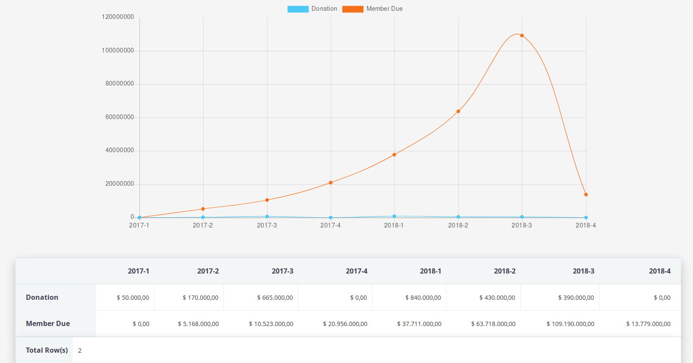

# ReportPlus

ReportPlus extends the default CiviCRM Form's Framweork adding new features

## Features

- Drag & Drop display column selection
- Collapsable filters grouped by Entity
- CiviCRM Basic Report enhaced (as Contribution Detail/Summary, Membership Detail/Summary, etc)
- All Entity fields is available as column, order by and filter in basic reports
- Permissions for access and administer
- Extra CSV export features as encoding selection, separator, enclose, etc
- Export to Excel out-of-the-box (until 2.3.3, then it will depend on [civiexportexcel](https://lab.civicrm.org/extensions/civiexportexcel) extension)
- [ChartJS](https://www.chartjs.org/) library included to render graphs
- New type of Report Template called **Matrix**, where you can select 2 dimensions (columns, rows) and stats for several entities
- And some more...

The extension is licensed under [AGPL-3.0](LICENSE.txt).

## Requirements

* PHP v5.6+ / PHP v7.0+

* CiviCRM 4.6+ - Use branch **1.x** (not maintained anymore)
* CiviCRM 4.7+ - Use branch **2.x**

## Usage

1. Install the extensions
2. Set Drupal perimissions as needed
3. Access to *Administer > CiviReport > Create New Report from Template* and at the end of the page you will see a new group of templtaes grouped by **ReportPlus Templates**

