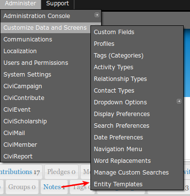

# Installation

* Follow the instructions to install extensions manually in the [CiviCRM documentation](https://docs.civicrm.org/sysadmin/en/latest/customize/extensions/#installing-a-new-extension).

After installation, you should have a new menu option available at the CiviCRM **Administration menu » Customize Data and Screens** called **Entity Templates**.  See screenshot:

